# GroupBuyingPlatform
拼团小程序 🎈系统亮点：AI拼单助手、WebSocket实时沟通、ECharts数据分析、活动拼单与商品拼团融合、信誉与保证金管理、余额支付与资金管理、 拼单分享与成员管理；

所有源码均本人开发，项目是前后端分离的，所有的项目都具备了完整的业务逻辑，不仅仅局限于基础的增删改查（CRUD）操作，系统亮点众多。

本文注重于计算机毕业设计选题指导，列出题目均有源码， 大家可以去【公众号】(毕业终点站)获取或者加我【qq】(2112698948)提意见(别忘记Star哟)。备注：git

声明：仅用于学习使用，请勿用于任何商业行为！

1.系统非商用，非开源，非无偿。

2.由本人开发，如需源码，请联系以下方式，qq:2112698948。

3.项目有很多，并未全部上传，如果未找到想要的，可直接咨询。

# DX6015 · 拼团小程序

> 本项目仅用于学习交流。文档展示 14 张截图，需要了解更多，请联系我。

## 项目简介

拼团小程序是一套面向活动组队与商品团购场景的综合服务平台，采用 **前后端分离 + 多角色** 架构，由微信小程序用户端、商家端与 Web 管理后台三部分组成。

平台把「用户发起活动、招募伙伴」与「商家发布商品拼团」两类需求融合在同一个体系中：普通用户可以浏览拼单广场、参与或发起拼单、缴纳保证金、管理订单并与其他成员实时沟通；商家可以经营商品拼团、处理订单发货；管理员负责拼单审核、商品订单监管、保证金记录与评价管理等平台治理工作。

在智能化与数据化方面，系统接入 DeepSeek 提供 AI 拼单助手辅助编写发布文案，通过 WebSocket 支撑用户与商家的在线即时沟通，并以 ECharts 对用户、商家、订单、交易额与拼单状态做多维统计分析，帮助掌握平台整体运营情况。

## 技术架构

| 类别 | 技术选型与说明 |
| :--- | :--- |
| 架构 | B/S、MVC、前后端分离、微信小程序用户端+商家端+管理后台、多角色业务管理 |
| 系统环境 | Windows |
| 开发环境 | IDEA、JDK17、Maven、MySQL、Node.js、HBuilderX、微信开发者工具 |
| 后端技术 | Java、Spring Boot 3、Spring MVC、MyBatis-Plus、MySQL、JWT、WebSocket、LangChain4j、DeepSeek、百度语音服务、微信小程序授权登录 |
| 后台技术 | Vue 3、Vite、Element Plus、Vue Router、Pinia、Axios、ECharts、Sass |
| 小程序技术 | uni-app、Vue 3、Pinia、uni-ui、微信小程序 API、地图定位、实时消息通信 |

## 系统亮点

1. **AI拼单助手**：接入 DeepSeek，辅助生成活动拼单内容，减少用户整理活动信息与编写发布文案的时间。

2. **WebSocket实时沟通**：通过 WebSocket 实现用户与商家的在线聊天，方便交流拼单意向、活动安排及商品配送信息。

3. **ECharts数据分析**：后台支持用户、商家、订单、交易额及拼单状态等多维统计，商家端展示销售趋势和热销商品，帮助掌握平台运营与店铺经营情况。

4. **活动拼单与商品拼团融合**：支持用户发起活动、招募伙伴，以及商家发布商品拼团，满足活动组队与商品团购两类需求。

5. **信誉与保证金管理**：提供信誉分、变动记录、保证金记录及活动评价，结合拼单参与记录查看用户履约情况，辅助平台维护拼单秩序。

6. **余额支付与资金管理**：支持商品订单余额支付、充值申请审核和商家提现审核，结合交易明细与退款记录展示平台资金流转过程。

7. **拼单分享与成员管理**：支持分享码分享、报名参与和成员管理，方便发起人邀请伙伴、查看参与情况并协调活动安排。

8. **完整拼团交易链路**：覆盖商品发布、拼团审核、用户参团、订单支付、商家发货、确认收货和评价售后，便于展示从开团到订单完成的业务流程。

9. **多角色协同管理**：提供普通用户、商家和管理员三类业务入口，覆盖报名参团、商品经营、入驻审核及平台管理，方便演示各角色的完整操作流程。

## 系统截图

> 截图存放于仓库 `images/` 目录，不依赖外部图床。

### 平台总览

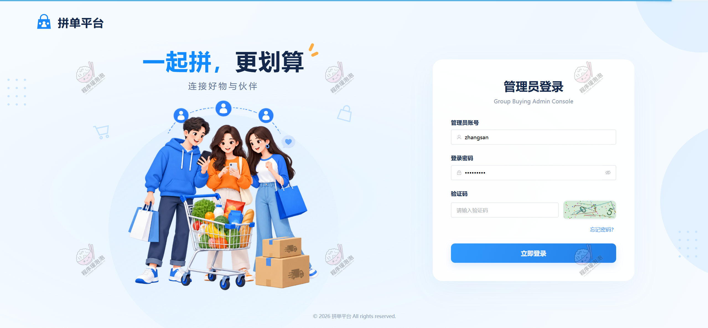

**图 1 · 平台总览**

### 用户端

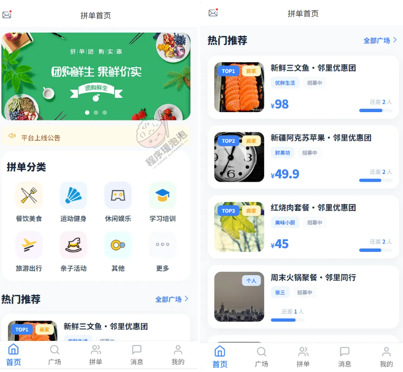

**图 2 · 首页**

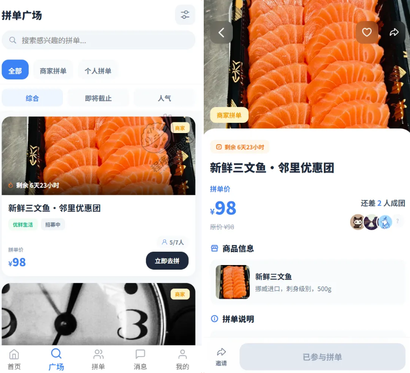

**图 3 · 拼单广场**

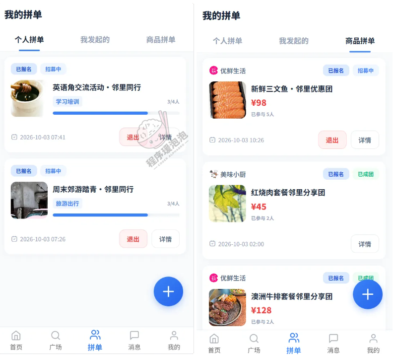

**图 4 · 我的拼单**

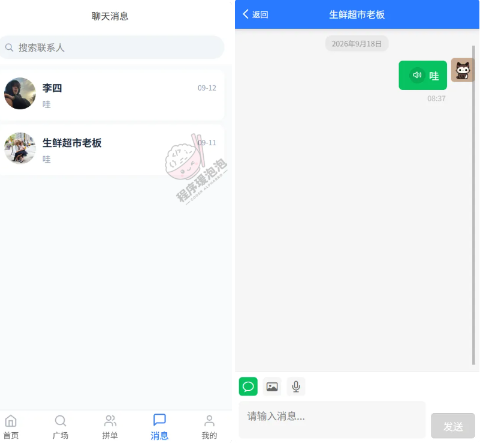

**图 5 · 我的消息**

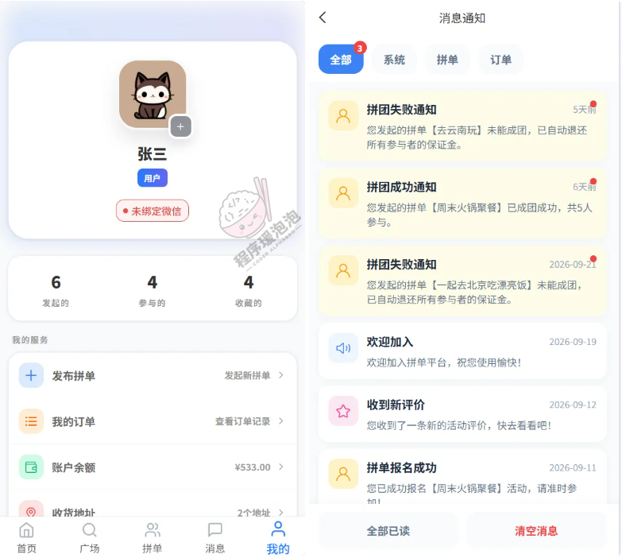

**图 6 · 个人中心**

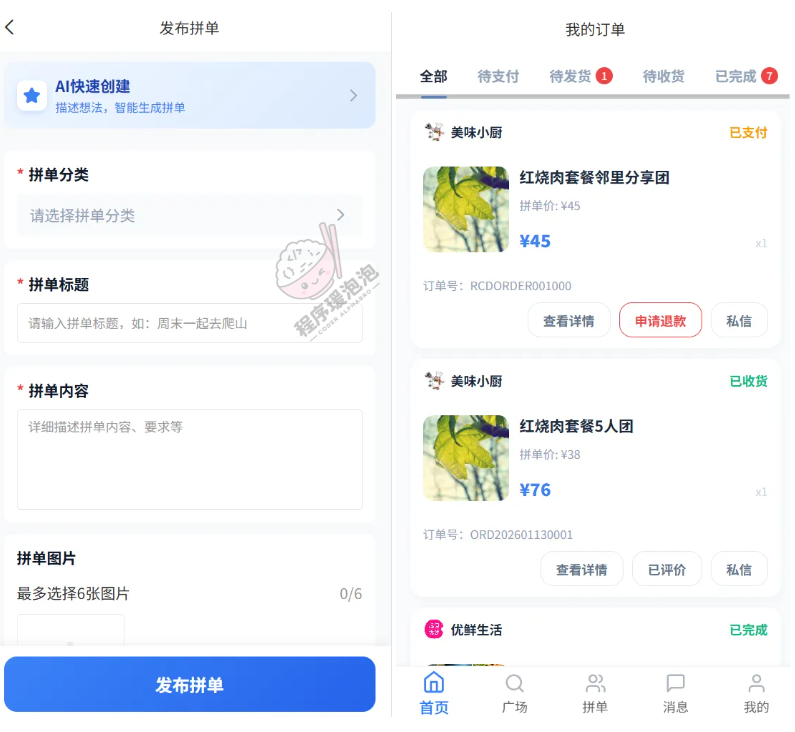

**图 7 · 发布拼单/我的订单**

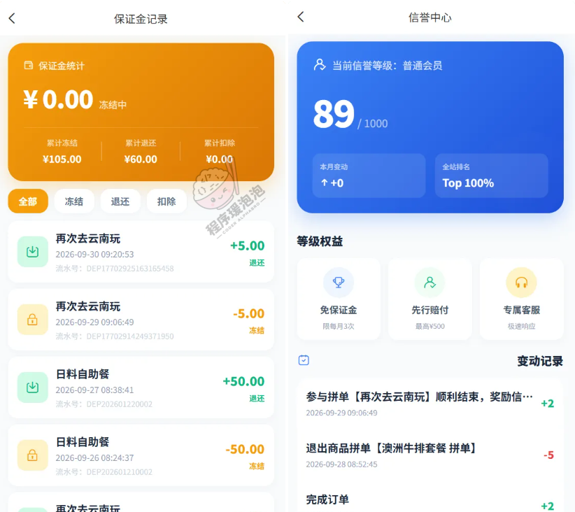

**图 8 · 保证金**

### 管理员端

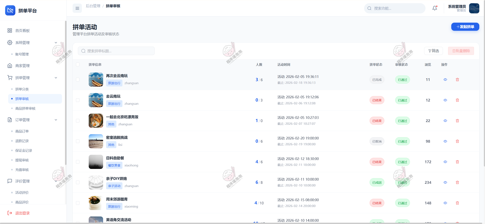

**图 9 · 拼单审核**

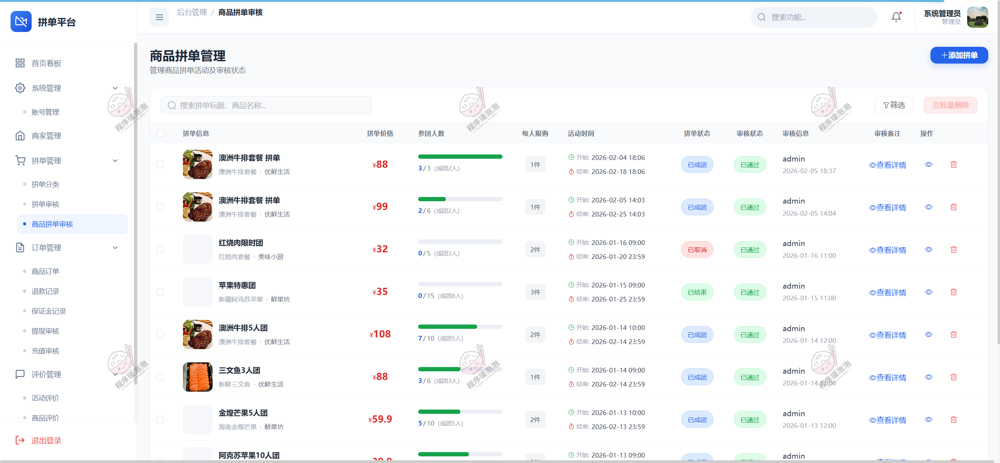

**图 10 · 商品拼单审核**

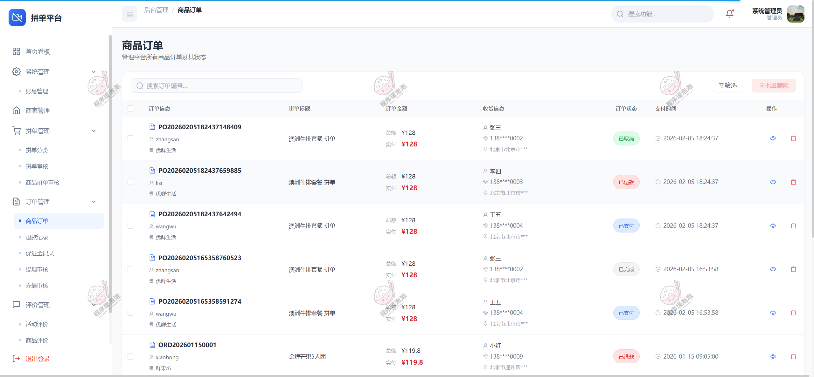

**图 11 · 商品订单**

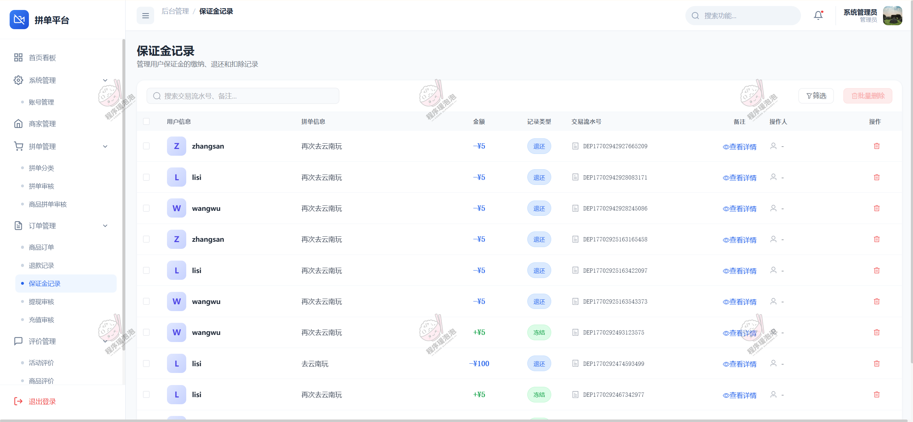

**图 12 · 保证金记录**

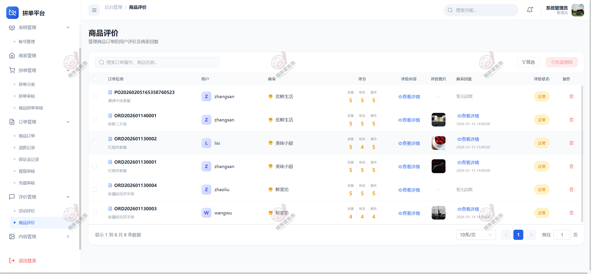

**图 13 · 商品评价**

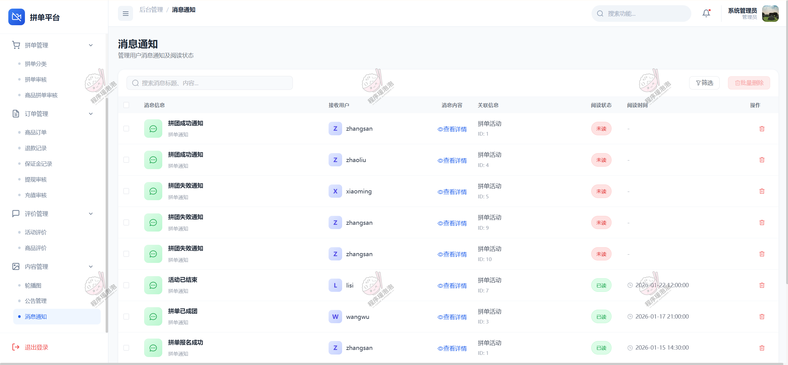

**图 14 · 消息通知**

---

**说明**：以上截图为系统部分功能演示页面，不同账号角色登录后可见菜单有所差异。

本项目仅用于学习交流，非商用、非开源、非无偿。

文档展示 14 张截图，需要了解更多，请联系我。
